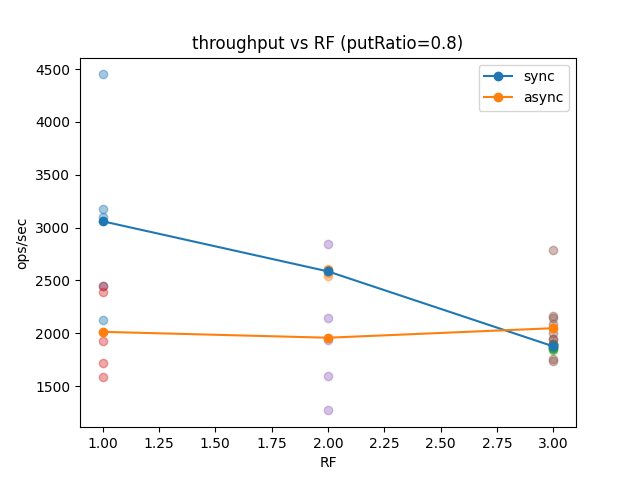
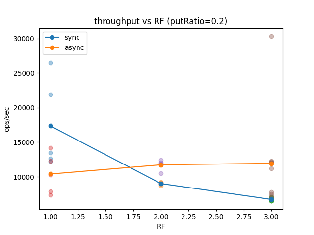
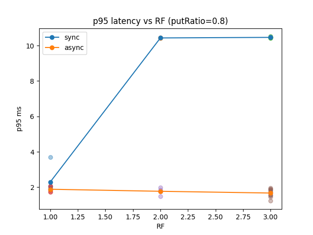
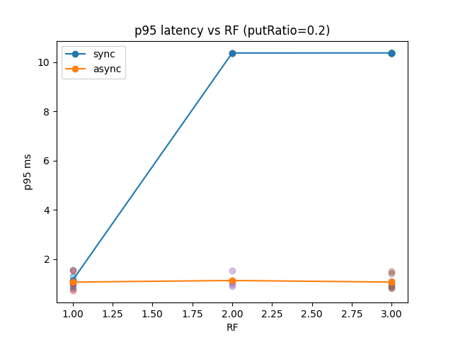
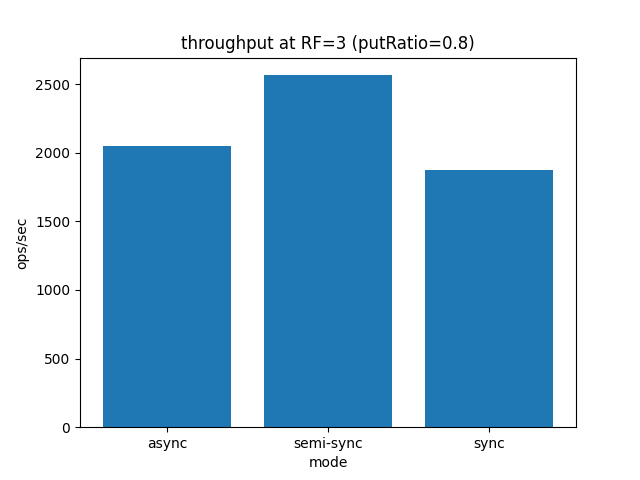

# Отчет

## Сводка запусков

| replicationMode | rf | k | threads | putRatio | throughputOpsSec | p50Ms | p95Ms |
|---|---|---|---|---|---|---|
| sync | 1 | 1 | 16 | 0.8 | 4449.84776009524 | 0.724 | 3.688 |
| sync | 1 | 1 | 16 | 0.8 | 3103.2382980248467 | 0.776 | 2.054 |
| sync | 1 | 1 | 16 | 0.8 | 3174.413830895666 | 0.602 | 1.904 |
| sync | 1 | 1 | 16 | 0.8 | 2445.3632587958477 | 0.576 | 1.847 |
| sync | 1 | 1 | 16 | 0.8 | 2129.0114115539654 | 0.601 | 1.953 |
| sync | 1 | 1 | 16 | 0.2 | 26531.043756081155 | 0.492 | 1.297 |
| sync | 1 | 1 | 16 | 0.2 | 12212.823560242534 | 0.375 | 0.907 |
| sync | 1 | 1 | 16 | 0.2 | 13481.606595184689 | 0.356 | 1.135 |
| sync | 1 | 1 | 16 | 0.2 | 12607.987904965563 | 0.321 | 0.812 |
| sync | 1 | 1 | 16 | 0.2 | 21936.236268304092 | 0.480 | 1.553 |
| sync | 2 | 1 | 16 | 0.8 | 2612.7672094481654 | 10.307 | 10.412 |
| sync | 2 | 1 | 16 | 0.8 | 2571.9640935201815 | 10.305 | 10.424 |
| sync | 2 | 1 | 16 | 0.8 | 2540.8641166741063 | 10.306 | 10.440 |
| sync | 2 | 1 | 16 | 0.8 | 2602.498577243631 | 10.305 | 10.444 |
| sync | 2 | 1 | 16 | 0.8 | 2599.820431416732 | 10.305 | 10.430 |
| sync | 2 | 1 | 16 | 0.2 | 9004.802845318874 | 0.130 | 10.368 |
| sync | 2 | 1 | 16 | 0.2 | 8960.563532564574 | 0.129 | 10.367 |
| sync | 2 | 1 | 16 | 0.2 | 9185.8569391462 | 0.130 | 10.368 |
| sync | 2 | 1 | 16 | 0.2 | 9213.420712512456 | 0.131 | 10.376 |
| sync | 2 | 1 | 16 | 0.2 | 8704.202160317695 | 0.129 | 10.363 |
| sync | 3 | 1 | 16 | 0.8 | 1862.684425933368 | 10.339 | 10.515 |
| sync | 3 | 1 | 16 | 0.8 | 1899.9530120435647 | 10.334 | 10.458 |
| sync | 3 | 1 | 16 | 0.8 | 1889.7005979386097 | 10.335 | 10.461 |
| sync | 3 | 1 | 16 | 0.8 | 1855.7839578683365 | 10.334 | 10.458 |
| sync | 3 | 1 | 16 | 0.8 | 1843.1554670235514 | 10.336 | 10.451 |
| sync | 3 | 1 | 16 | 0.2 | 6733.821671809321 | 0.125 | 10.376 |
| sync | 3 | 1 | 16 | 0.2 | 6552.338449146166 | 0.126 | 10.380 |
| sync | 3 | 1 | 16 | 0.2 | 6510.9918827031215 | 0.121 | 10.366 |
| sync | 3 | 1 | 16 | 0.2 | 6533.802045990069 | 0.122 | 10.369 |
| sync | 3 | 1 | 16 | 0.2 | 7083.653545169407 | 0.123 | 10.375 |
| async | 1 | 1 | 16 | 0.8 | 1924.0132900248304 | 0.651 | 1.727 |
| async | 1 | 1 | 16 | 0.8 | 2443.2358492112385 | 0.577 | 1.738 |
| async | 1 | 1 | 16 | 0.8 | 2391.430403657822 | 0.687 | 1.857 |
| async | 1 | 1 | 16 | 0.8 | 1588.3005930790653 | 0.805 | 2.049 |
| async | 1 | 1 | 16 | 0.8 | 1722.1254946715287 | 0.795 | 2.061 |
| async | 1 | 1 | 16 | 0.2 | 12263.646865281467 | 0.381 | 0.998 |
| async | 1 | 1 | 16 | 0.2 | 7848.111135368925 | 0.423 | 1.036 |
| async | 1 | 1 | 16 | 0.2 | 14189.289036244056 | 0.287 | 0.722 |
| async | 1 | 1 | 16 | 0.2 | 10266.388106362687 | 0.463 | 1.550 |
| async | 1 | 1 | 16 | 0.2 | 7415.465766591274 | 0.428 | 1.048 |
| async | 2 | 1 | 16 | 0.8 | 2848.03505423518 | 0.506 | 1.477 |
| async | 2 | 1 | 16 | 0.8 | 2142.002912707556 | 0.627 | 1.776 |
| async | 2 | 1 | 16 | 0.8 | 1270.232599632628 | 0.744 | 1.838 |
| async | 2 | 1 | 16 | 0.8 | 1597.8484594679305 | 0.817 | 1.992 |
| async | 2 | 1 | 16 | 0.8 | 1931.9404132402713 | 0.713 | 1.771 |
| async | 2 | 1 | 16 | 0.2 | 11818.764899096981 | 0.422 | 1.088 |
| async | 2 | 1 | 16 | 0.2 | 11900.51479520613 | 0.443 | 0.999 |
| async | 2 | 1 | 16 | 0.2 | 12054.161955777121 | 0.394 | 1.141 |
| async | 2 | 1 | 16 | 0.2 | 12423.78603608591 | 0.361 | 0.914 |
| async | 2 | 1 | 16 | 0.2 | 10466.122831050747 | 0.454 | 1.542 |
| async | 3 | 1 | 16 | 0.8 | 1949.6403767203733 | 0.561 | 1.548 |
| async | 3 | 1 | 16 | 0.8 | 2090.5887700044996 | 0.815 | 1.906 |
| async | 3 | 1 | 16 | 0.8 | 1735.1850604673132 | 0.702 | 1.730 |
| async | 3 | 1 | 16 | 0.8 | 1897.9594516091797 | 0.684 | 1.945 |
| async | 3 | 1 | 16 | 0.8 | 1999.3928551683925 | 0.459 | 1.227 |
| async | 3 | 1 | 16 | 0.2 | 30309.45085503643 | 0.440 | 1.040 |
| async | 3 | 1 | 16 | 0.2 | 7215.456686940431 | 0.431 | 1.068 |
| async | 3 | 1 | 16 | 0.2 | 7776.769586567506 | 0.319 | 0.814 |
| async | 3 | 1 | 16 | 0.2 | 12243.456819361438 | 0.379 | 0.904 |
| async | 3 | 1 | 16 | 0.2 | 11173.839163243969 | 0.425 | 1.427 |
| async | 3 | 1 | 16 | 0.8 | 1945.9141984925375 | 0.575 | 1.446 |
| async | 3 | 1 | 16 | 0.8 | 2790.2646609028848 | 0.564 | 1.559 |
| async | 3 | 1 | 16 | 0.8 | 2149.08282549951 | 0.536 | 1.694 |
| async | 3 | 1 | 16 | 0.8 | 1758.3455000079393 | 0.773 | 1.863 |
| async | 3 | 1 | 16 | 0.8 | 2166.401845235718 | 0.644 | 1.805 |
| async | 3 | 1 | 16 | 0.2 | 12075.911330551246 | 0.445 | 1.059 |
| async | 3 | 1 | 16 | 0.2 | 12230.731988425532 | 0.365 | 0.846 |
| async | 3 | 1 | 16 | 0.2 | 6857.672502229027 | 0.431 | 1.499 |
| async | 3 | 1 | 16 | 0.2 | 7552.308390549974 | 0.384 | 0.949 |
| async | 3 | 1 | 16 | 0.2 | 12007.834389067237 | 0.434 | 1.112 |
| semi-sync | 3 | 1 | 16 | 0.8 | 2621.2703787516793 | 10.303 | 10.417 |
| semi-sync | 3 | 1 | 16 | 0.8 | 2623.6345209359597 | 10.303 | 10.434 |
| semi-sync | 3 | 1 | 16 | 0.8 | 2527.336197472883 | 10.304 | 10.435 |
| semi-sync | 3 | 1 | 16 | 0.8 | 2559.2782776291315 | 10.304 | 10.431 |
| semi-sync | 3 | 1 | 16 | 0.8 | 2496.427051505263 | 10.306 | 10.453 |
| semi-sync | 3 | 1 | 16 | 0.2 | 9394.130958346219 | 0.131 | 10.368 |
| semi-sync | 3 | 1 | 16 | 0.2 | 9684.538088588353 | 0.130 | 10.366 |
| semi-sync | 3 | 1 | 16 | 0.2 | 8449.51101158864 | 0.130 | 10.373 |
| semi-sync | 3 | 1 | 16 | 0.2 | 9227.380002737451 | 0.128 | 10.360 |
| semi-sync | 3 | 1 | 16 | 0.2 | 8530.214388509128 | 0.128 | 10.364 |
| sync | 3 | 1 | 16 | 0.8 | 1866.298417223069 | 10.329 | 10.429 |
| sync | 3 | 1 | 16 | 0.8 | 1893.4596547368153 | 10.332 | 10.450 |
| sync | 3 | 1 | 16 | 0.8 | 1895.7383663514665 | 10.336 | 10.460 |
| sync | 3 | 1 | 16 | 0.8 | 1861.355042938147 | 10.331 | 10.458 |
| sync | 3 | 1 | 16 | 0.8 | 1890.8755838786499 | 10.339 | 10.475 |
| sync | 3 | 1 | 16 | 0.2 | 6504.862390816756 | 0.122 | 10.371 |
| sync | 3 | 1 | 16 | 0.2 | 7055.177413724352 | 0.121 | 10.365 |
| sync | 3 | 1 | 16 | 0.2 | 6721.260759145116 | 0.123 | 10.374 |
| sync | 3 | 1 | 16 | 0.2 | 6670.356852601924 | 0.120 | 10.363 |
| sync | 3 | 1 | 16 | 0.2 | 6925.325621054337 | 0.121 | 10.364 |

## Графики

Пропускная способность vs RF (с акцентом на запись):

Пропускная способность vs RF (с акцентом на чтение):

Задержка p95 vs RF (с акцентом на запись):

Задержка p95 vs RF (с акцентом на чтение):

Сравнение пропускной способности при RF=3:

## Наблюдения

- С ростом RF синхронная репликация замедляется, так как каждый PUT ждёт больше подтверждений и дополнительных сетевых раундов.
- Async работает быстрее, но может отдавать устаревшие чтения с follower при лаге.
- Semi-sync находится между async и sync: быстрый ответ после K ACK и догон до RF в фоне.
- Read-heavy профиль менее чувствителен к RF, потому что GET не ждёт репликации, а write-heavy упирается в сетевые подтверждения.
